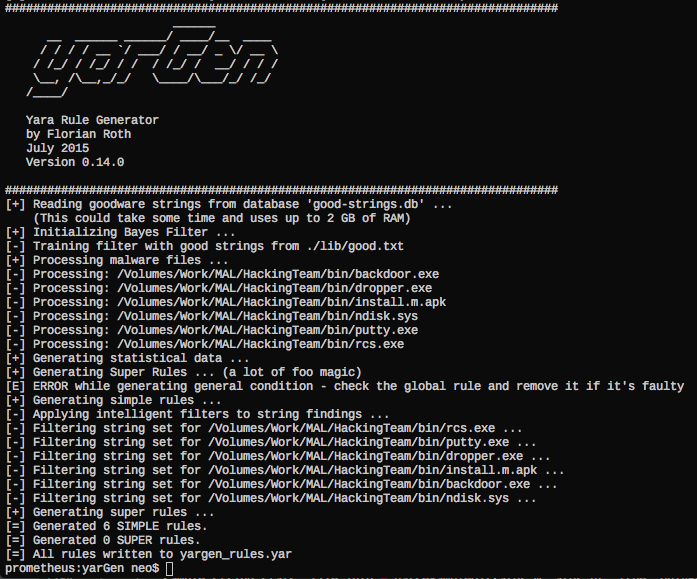

# yarGen

[](https://gitter.im/Neo23x0/yarGen?utm_source=badge&utm_medium=badge&utm_campaign=pr-badge&utm_content=badge)

A Rule Generator for Yara Rules

Florian Roth, May 2015

yarGen is a generator for Yara rules. The reason why I developed another Yara
rule generator was a special use case in which I had a directory full of 
hackware samples for which I had to write Yara rules. 

### What does yarGen do?

The main principle is the creation of yara rules from strings found in malware
files while removing all strings that also appear in goodware files. 

Since yarGen version 0.6 ships with a goodware strings database that can be 
used to create your rules wihtout scanning any goodware directories and thus
making the process of rule creation much faster.
This way I minimized the chance to trigger false positives with the newly 
generated rules.

Since version 0.7 it supports utf16le encoded strings (wide; Unicode strings) 
strings and uses the GibberishDetector of Rob Renaud to value strings higher
that contain language words in contrast to totally mixed up character chains.  
https://github.com/rrenaud/Gibberish-Detector

Since version 0.12.0 yarGen does not completely remove the goodware strings from the analysis process but includes them with a very low score. The rules will be included if no better strings can be found and marked with a comment /* Goodware rule */. Force yarGen to remvoe all goodware strings with --excludegood. Also since version 0.12.0 yarGen allows to place the "strings.xml" from [PEstudio](https://winitor.com/) in the program directory in order to apply the blacklist definition during the string analysis process. You'll get better results. 

The rule generation process tries to identify similarities between the files 
that get analyzed and then combines the strings to so called "super rules". 
Up to now the super rule generation does not remove the simple rule for the
files that have been combined in a single super rule. This means that there
is some redundancy when super rules are created. You can supress a simple rule
for a file that was already covered by super rule by using --nosimple. 

### Memory Requirements

Warning: yarGen pulls the whole goodstring database to memory and uses up to 
2000 Megabyte of memory for a few seconds. 

## Command Line Parameters

```

usage: yarGen.py [-h] [-m M] [-g G] [-u] [-c] [-o output_rule_file]
                 [-p prefix] [-a author] [-r ref] [-l min-size] [-s max-size]
                 [-nr] [-oe] [-fs size-in-MB] [--score] [--excludegood]
                 [--nosimple] [--nomagic] [--nofilesize] [-fm FM] [--noglobal]
                 [-rc maxstrings] [--nosuper] [--debug]

yarGen

optional arguments:
  -h, --help           show this help message and exit
  -m M                 Path to scan for malware
  -g G                 Path to scan for goodware (dont use the database
                       shipped with yara-brg)
  -u                   Update local goodware database (use with -g)
  -c                   Create new local goodware database (use with -g)
  -o output_rule_file  Output rule file
  -p prefix            Prefix for the rule description
  -a author            Author Name
  -r ref               Reference
  -l min-size          Minimum string length to consider (default=6)
  -s max-size          Maximum length to consider (default=64)
  -nr                  Do not recursively scan directories
  -oe                  Only scan executable extensions EXE, DLL, ASP, JSP,
                       PHP, BIN, INFECTED
  -fs size-in-MB       Max file size in MB to analyze (default=3)
  --score              Show the string scores as comments in the rules
  --excludegood        Force the exclude all goodware strings
  --nosimple           Skip single rule creation for files included in super
                       rules
  --nomagic            Don't include the magic header condition statement
  --nofilesize         Don't include the filesize condition statement
  -fm FM               Multiplier for the maximum 'filesize' condition
                       (default: 5)
  --noglobal           Don't create global rules
  -rc maxstrings       Maximum number of strings per rule (default=20,
                       intelligent filtering will be applied)
  --nosuper            Don't try to create super rules that match against
                       various files
  --debug              Debug output
```

## Best Practice

See the following blog post for a more detailed description on how to use yarGen for YARA rule creation: [How to Write Simple but Sound Yara Rules](https://www.bsk-consulting.de/2015/02/16/write-simple-sound-yara-rules/)
  
## Screenshots




As you can see in the screenshot above you'll get a rule that contains strings, which are not found in the goodware strings database. 

You should clean up the rules afterwards. In the example above, remove the strings $s14, $s17, $s19, $s20 that look like random code to get a cleaner rule that is more likely to match on other samples of the same family. 

To get a more generic rule, remove string $s5, which is very specific for this compiled executable. 
 
## Examples

### Use the shipped database (FAST) to create some rules

python yarGen.py -m X:\MAL\Case1401

Use the shipped database of goodware strings and scan the malware directory 
"X:\MAL" recursively. Create rules for all files included in this directory and 
below. A file named 'yargen_rules.yar' will be generated in the current 
directory. 

### Preset author and reference

python yarGen.py -a "Florian Roth" -r "http://goo.gl/c2qgFx" -m /opt/mal/case_441 -o case441.yar

### Exclude strings from Goodware samples

python yarGen.py --excludegood -m /opt/mal/case_441

### Supress simple rule if alreay covered by a super rules

python yarGen.py --nosimple -m /opt/mal/case_441

### Show debugging output

python yarGen.py --debug -m /opt/mal/case_441

### Create a new goodware strings database

python yarGen.py -c -g C:\Windows\System32

### Update the goodware strings database (append new strings to the old ones)

python yarGen.py -u -g "C:\Program Files"
