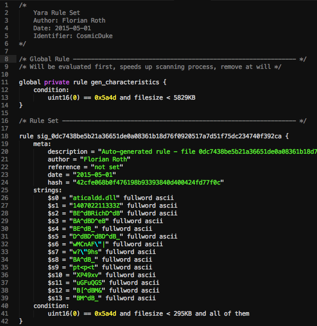

# yarGen

A Rule Generator for Yara Rules

Florian Roth, January 2015

yarGen is a generator for Yara rules. The reason why I developed another Yara
rule generator was a special use case in which I had a directory full of 
hackware samples for which I had to write Yara rules. 

### What does yarGen do?

The main principle is the creation of yara rules from strings found in malware
files while removing all strings that also appear in goodware files. 

Since yarGen version 0.6 ships with a goodware strings database that can be 
used to create your rules wihtout scanning any goodware directories and thus
making the process of rule creation much faster.
This way I minimized the chance to trigger false positives with the newly 
generated rules.

Since version 0.7 it supports utf16le encoded strings (wide; Unicode strings) 
strings and uses the GibberishDetector of Rob Renaud to value strings higher
that contain language words in contrast to totally mixed up character chains.  
https://github.com/rrenaud/Gibberish-Detector

The rule generation process tries to identify similarities between the files 
that get analyzed and then combines the strings to so called "super rules". 
Up to now the super rule generation does not remove the simple rule for the
files that have been combined in that single super rule. This means that there
is some redundancy when super rules are created. It is you task to identify
and check the super rules and remove the simple rules matching on a single 
file if the super rule works well for you.

### Memory Requirements

Warning: yarGen pulls the whole goodstring database to memory and uses up to 
1200 Megabyte of memory for a few seconds. 

## Command Line Parameters

```
usage: yarGen.py [-h] [-m M] [-g G] [-u] [-c] [-o output_rule_file]
                 [-p prefix] [-a author] [-r ref] [-l min-size] [-s max-size]
                 [-nr] [-oe] [-fs dir] [-rc maxstrings] [--nosuper]
                 [--debug]

yarGen
optional arguments:

   -h, --help           show this help message and exit
   -m M                 Path to scan for malware
   -g G                 Path to scan for goodware (dont use the database shipped with yara-brg)
   -u                   Update local goodware database (use with -g)
   -c                   Create new local goodware database (use with -g)
   -o output_rule_file  Output rule file
   -p prefix            Prefix for the rule description
   -a author            Athor Name
   -r ref               Reference
   -l min-size          Minimum string length to consider (default=6)
   -s max-size          Maximum length to consider (default=64)
   -nr                  Don't scan directories recursively
   -oe                  Only scan executable extensions EXE, DLL, ASP, JSP, PHP, BIN, INFECTED
   -fs dir              Max file size to analyze (default=2000000)
   -rc maxstrings       Maximum number of strings per rule (default=20, intelligent filtering will be applied)
   --nosuper            Don't try to create super rules that match against various files
   --debug              Debug output
```
  
## Screenshots



 
## Examples

### Use the shipped database (FAST) to create some rules

python yarGen.py -m X:\MAL\Case1401

Use the shipped database of goodware strings and scan the malware directory 
"X:\MAL" recursively. Create rules for all files included in this directory and 
below. A file named 'yargen_rules.yar' will be generated in the current 
directory. 

### Preset Author and Reference

python yarGen.py -a "Florian Roth" -r "http://goo.gl/c2qgFx" -m /opt/mal/case_441

### Create a new goodware strings database

python yarGen.py -c -g C:\Windows\System32

### Update the goodware strings database (append new strings to the old ones)

python yarGen.py -u -g "C:\Program Files"
